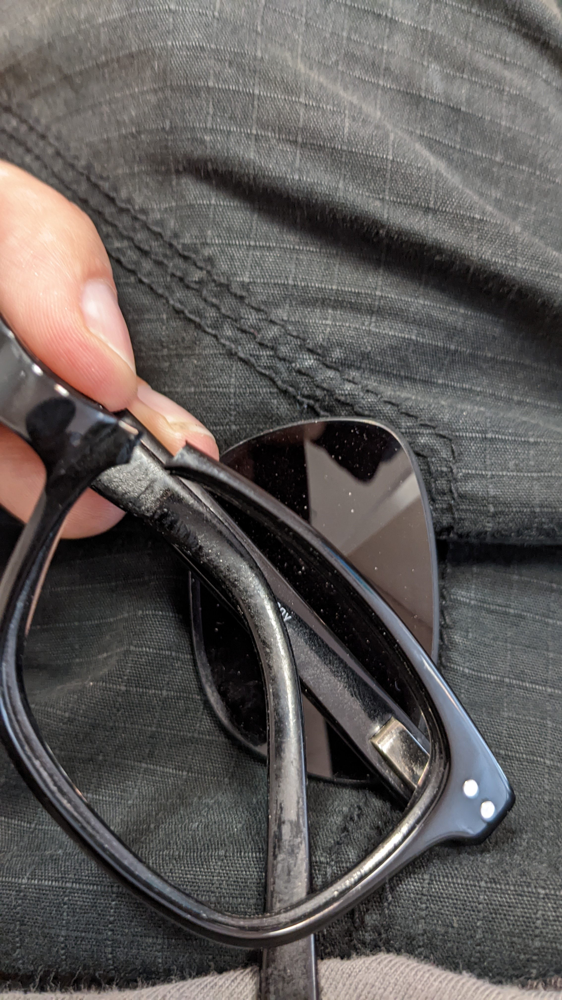

 
Die Vorbereitungen laufen! Ein erster Schock und genügend Platz.. bis jetzt
 
<!--more-->
 
## Vorbereitungen
 
Die Vorbereitungen haben natürlich schon vor zwei Wochen angefangen, als mein Zelt mal wieder aufgebaut habe um zu checken ob alles okay ist. Jetzt geht es aber ans Probepacken!
Hab ich wohl genug Platz für alles? Noch bevor es losging gab es schon den ersten Schock... meine Sonnenbrille mit stärke ist kaputt!
 

 
Glücklicherweise habe ich das eine Woche vorher festgestellt und mir heute direkt eine neue Anfertigen lassen. Bin gespannt ob die bis Freitag fertig wird.
 
Also weiter mit Probepacken und erstmal alles hinlegen, was ich so brauche:

 
Die shoppingliste war groß:
- neue Schuhe mit denen man auch Wandern kann
- eine Axt, falls ich Holz hacken muss
- Zeug aus der Apotheke wie Wundsalbe, Allergietabletten (die guten teuren), Kompressen, Mückenspray incl. Zeckenschutz
 
Immer raus mit dem Geld! Hauptsache es fehlt mir an nicht.
Das Packen ging dann auch gut und alles passt. Ich habe sogar genug Platz um Essen zu verstauen - das war mir sehr wichtig.
 
Meine Prioritätenliste ist die folgende:
 
1. SCHLAF! Ohne guten schlaf, kann ich gleich hier bleiben
2. Essen! Ohne Mampf kein Kampf!
3. Alles andere...
 
Bei meinem letzten Ausflug nach Brandenburg habe ich bei -1°C in der nacht ziemlich schlecht geschlafen, weil die Luft aus meiner Isomatte entwichen ist. Die 75km Heimweg am nächsten Tag bei 4°C waren entsprechend anstrengend. Wenn ich hunger habe, kann ich überall was essen, aber wenn mir der Schlaf fehlt, kann ich den nicht einfach nachholen. Deshalb ist Schlaf meine höchste Priorität! Die Isomatte bleibt im Schrank, ich hab mir direkt eine neue Gekauft.
 
Beim Essen gibt es nicht viel zu sagen - ich werde lange unterwegs sein und habe keine lust mich nur von Dosenfutter und Suppentüten zu ernähren. One-Pot-Gerichte werden mir auf dem Weg dann schon noch einfallen und im schlimmsten Fall, geh ich einfach essen.
 
In nur 4 Tagen geht es dann schon los!
